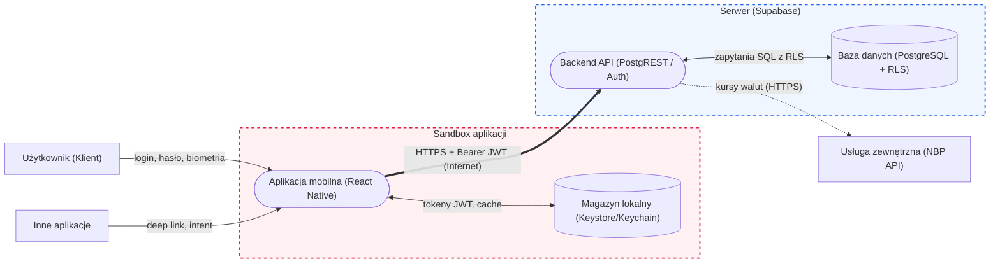

# Diagram Przepływu Danych (DFD) – SecureBank

```mermaid
flowchart LR
    %% Encje zewnętrzne (Aktorzy)
    USER["Użytkownik (Klient)"]
    OTHER_APPS["Inne aplikacje"]
    EXT_SVC["Usługa zewnętrzna (NBP API)"]

    %% Granica zaufania 1: Urządzenie mobilne
    subgraph TB_APP ["Sandbox aplikacji"]
        APP(["Aplikacja mobilna (React Native)"])
        LOCAL_STORE[("Magazyn lokalny (Keystore/Keychain)")]
    end

    %% Granica zaufania 2: Środowisko serwerowe
    subgraph TB_SRV ["Serwer (Supabase)"]
        API(["Backend API (PostgREST / Auth)"])
        DB[("Baza danych (PostgreSQL + RLS)")]
    end

    %% Przepływy danych
    USER -->|"login, hasło, biometria"| APP
    OTHER_APPS -->|"deep link, intent"| APP
    APP <-->|"tokeny JWT, cache"| LOCAL_STORE

    APP == "HTTPS + Bearer JWT (Internet)" ==> API

    API <-->|"zapytania SQL z RLS"| DB
    API -. "kursy walut (HTTPS)" .-> EXT_SVC

    %% Granice zaufania (przerywane linie)
    style TB_APP stroke:#e11d48,stroke-width:2px,stroke-dasharray: 5 5,fill:#fff1f2
    style TB_SRV stroke:#2563eb,stroke-width:2px,stroke-dasharray: 5 5,fill:#eff6ff
```
